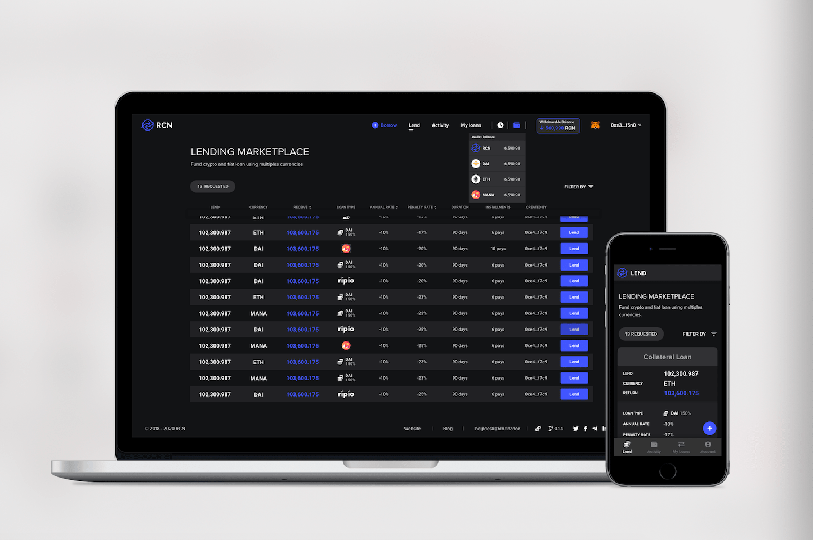

# RCN | Credit Marketplace

RCN is an open-source global credit network that connects lenders, borrowers and loan originators on the blockchain to create frictionless, transparent and borderless debt markets.

The RCN Credit Marketplace allows users to lend DeFi & CeFi Loans, borrow P2P Loans and manage it all in one place.

The Credit Marketplace can be accesed from [rcn.market](https://rcn.market).

## Development information
This project was generated with [Angular CLI](https://github.com/angular/angular-cli).

## Development server

First Run `npm install` for install dependencies and Run `npm start` for a dev server. Navigate to `http://localhost:4200/`. The app will automatically reload if you change any of the source files.

## Code scaffolding

Run `ng generate component component-name` to generate a new component. You can also use `ng generate directive|pipe|service|class|guard|interface|enum|module`.

## Build

Run `ng build` to build the project. The build artifacts will be stored in the `dist/` directory. Use the `-prod` flag for a production build.

## Running unit tests

Run `ng test` to execute the unit tests via [Karma](https://karma-runner.github.io).

## Further help

To get more help on the Angular CLI use `ng help` or go check out the [Angular CLI README](https://github.com/angular/angular-cli/blob/master/README.md).

## Flowcharts

Flowcharts of the main actions of the dApp.

https://miro.com/app/embed/o9J_kvh1FQk=/?&pres=1&animate=1
